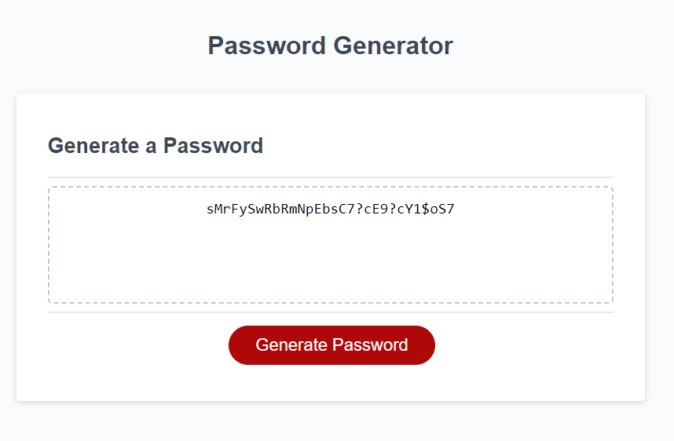

# 03 JavaScript: Password Generator

The webpage uses JavaScript to prompt the user for password criteria.
The button triggers a script to cycle through character types to guarantee
the user has all characters in their password, but it isn't necessarily random in order given the usage of a loop. 

You can access the live page at the following link 
https://tjansson-ui.github.io/password-generator-uw/

